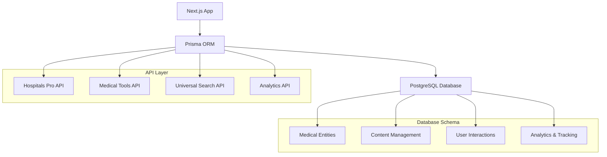

# تصميم توحيد قاعدة البيانات PostgreSQL

## هيكل النظام الموحد

### 1. معمارية قاعدة البيانات



### 2. Schema PostgreSQL المحدث

#### الجداول الأساسية (محسنة)
```sql
-- تحسين جدول المستشفيات
ALTER TABLE hospitals ADD COLUMN IF NOT EXISTS 
  search_vector tsvector,
  metadata jsonb DEFAULT '{}',
  working_hours jsonb DEFAULT '{}',
  services jsonb DEFAULT '[]',
  insurance_accepted jsonb DEFAULT '[]',
  emergency_services jsonb DEFAULT '{}',
  parking_available boolean DEFAULT false,
  wheelchair_accessible boolean DEFAULT false,
  languages_spoken jsonb DEFAULT '[]';

-- إضافة فهارس للبحث السريع
CREATE INDEX IF NOT EXISTS hospitals_search_idx ON hospitals USING GIN(search_vector);
CREATE INDEX IF NOT EXISTS hospitals_location_idx ON hospitals USING GIST(ST_Point(lng, lat));
CREATE INDEX IF NOT EXISTS hospitals_metadata_idx ON hospitals USING GIN(metadata);

-- تحسين جدول المقالات
ALTER TABLE articles ADD COLUMN IF NOT EXISTS
  search_vector tsvector,
  reading_time integer DEFAULT 0,
  difficulty_level varchar(20) DEFAULT 'beginner',
  medical_specialties jsonb DEFAULT '[]',
  target_audience jsonb DEFAULT '[]',
  fact_checked boolean DEFAULT false,
  medical_disclaimer boolean DEFAULT true;

CREATE INDEX IF NOT EXISTS articles_search_idx ON articles USING GIN(search_vector);
CREATE INDEX IF NOT EXISTS articles_specialties_idx ON articles USING GIN(medical_specialties);
```

#### الجداول الجديدة
```sql
-- جدول الأدوات الطبية
CREATE TABLE medical_tools (
    id uuid PRIMARY KEY DEFAULT gen_random_uuid(),
    name_ar varchar(100) NOT NULL,
    name_en varchar(100),
    slug varchar(120) UNIQUE NOT NULL,
    description_ar text NOT NULL,
    description_en text,
    tool_type varchar(20) NOT NULL CHECK (tool_type IN ('calculator', 'checker', 'converter', 'tracker', 'assessment')),
    component_name varchar(100) NOT NULL,
    config jsonb DEFAULT '{}',
    medical_specialties jsonb DEFAULT '[]',
    target_conditions jsonb DEFAULT '[]',
    accuracy_level varchar(20) DEFAULT 'reference' CHECK (accuracy_level IN ('reference', 'screening', 'diagnostic')),
    icon varchar(50),
    featured_image text,
    instructions_ar text,
    instructions_en text,
    usage_count integer DEFAULT 0,
    average_rating decimal(3,2) DEFAULT 0.00,
    rating_count integer DEFAULT 0,
    is_active boolean DEFAULT true,
    is_featured boolean DEFAULT false,
    meta_title_ar varchar(60),
    meta_title_en varchar(60),
    meta_description_ar varchar(160),
    meta_description_en varchar(160),
    search_vector tsvector,
    created_at timestamp DEFAULT now(),
    updated_at timestamp DEFAULT now()
);

CREATE INDEX medical_tools_search_idx ON medical_tools USING GIN(search_vector);
CREATE INDEX medical_tools_type_idx ON medical_tools(tool_type);
CREATE INDEX medical_tools_featured_idx ON medical_tools(is_featured, usage_count DESC);

-- جدول التقييمات الموحد
CREATE TABLE ratings (
    id serial PRIMARY KEY,
    entity_type varchar(20) NOT NULL CHECK (entity_type IN ('hospital', 'clinic', 'lab', 'pharmacy', 'article', 'tool', 'drug')),
    entity_id integer NOT NULL,
    user_ip inet NOT NULL,
    rating smallint NOT NULL CHECK (rating >= 1 AND rating <= 5),
    comment text,
    is_helpful boolean,
    created_at timestamp DEFAULT now(),
    UNIQUE(entity_type, entity_id, user_ip)
);

CREATE INDEX ratings_entity_idx ON ratings(entity_type, entity_id);
CREATE INDEX ratings_created_idx ON ratings(created_at);

-- جدول المفضلة الموحد
CREATE TABLE favorites (
    id serial PRIMARY KEY,
    entity_type varchar(20) NOT NULL CHECK (entity_type IN ('hospital', 'clinic', 'lab', 'pharmacy', 'article', 'tool', 'drug')),
    entity_id integer NOT NULL,
    user_ip inet NOT NULL,
    created_at timestamp DEFAULT now(),
    UNIQUE(entity_type, entity_id, user_ip)
);

CREATE INDEX favorites_entity_idx ON favorites(entity_type, entity_id);
CREATE INDEX favorites_user_idx ON favorites(user_ip);

-- جدول سجل المشاهدات
CREATE TABLE view_logs (
    id serial PRIMARY KEY,
    entity_type varchar(20) NOT NULL,
    entity_id integer NOT NULL,
    user_ip inet NOT NULL,
    user_agent text,
    referer text,
    session_id varchar(100),
    created_at timestamp DEFAULT now()
);

CREATE INDEX view_logs_entity_idx ON view_logs(entity_type, entity_id);
CREATE INDEX view_logs_created_idx ON view_logs(created_at);
CREATE INDEX view_logs_session_idx ON view_logs(session_id);

-- جدول التحليلات اليومية
CREATE TABLE analytics (
    id serial PRIMARY KEY,
    entity_type varchar(20) NOT NULL,
    entity_id integer NOT NULL,
    date date NOT NULL,
    views integer DEFAULT 0,
    unique_views integer DEFAULT 0,
    time_spent integer DEFAULT 0,
    bounce_rate decimal(5,2) DEFAULT 0.00,
    likes integer DEFAULT 0,
    shares integer DEFAULT 0,
    comments integer DEFAULT 0,
    direct_traffic integer DEFAULT 0,
    search_traffic integer DEFAULT 0,
    social_traffic integer DEFAULT 0,
    referral_traffic integer DEFAULT 0,
    created_at timestamp DEFAULT now(),
    UNIQUE(entity_type, entity_id, date)
);

CREATE INDEX analytics_entity_date_idx ON analytics(entity_type, entity_id, date);
CREATE INDEX analytics_date_idx ON analytics(date);

-- جدول علامات المقالات
CREATE TABLE article_tags (
    id serial PRIMARY KEY,
    name_ar varchar(50) UNIQUE NOT NULL,
    name_en varchar(50),
    slug varchar(60) UNIQUE NOT NULL,
    color varchar(7) DEFAULT '#10B981',
    usage_count integer DEFAULT 0,
    created_at timestamp DEFAULT now()
);

-- جدول ربط المقالات بالعلامات
CREATE TABLE article_tag_relations (
    article_id integer REFERENCES articles(id) ON DELETE CASCADE,
    tag_id integer REFERENCES article_tags(id) ON DELETE CASCADE,
    PRIMARY KEY (article_id, tag_id)
);

-- جدول نصائح صحية
CREATE TABLE health_tips (
    id serial PRIMARY KEY,
    title_ar varchar(150) NOT NULL,
    title_en varchar(150),
    content_ar text NOT NULL,
    content_en text,
    category_id integer REFERENCES article_categories(id),
    frequency varchar(20) DEFAULT 'daily' CHECK (frequency IN ('daily', 'weekly', 'monthly', 'seasonal')),
    scheduled_date date,
    is_seasonal boolean DEFAULT false,
    season_months jsonb DEFAULT '[]',
    icon varchar(50),
    image text,
    view_count integer DEFAULT 0,
    like_count integer DEFAULT 0,
    share_count integer DEFAULT 0,
    is_active boolean DEFAULT true,
    created_at timestamp DEFAULT now(),
    updated_at timestamp DEFAULT now()
);

CREATE INDEX health_tips_category_idx ON health_tips(category_id);
CREATE INDEX health_tips_scheduled_idx ON health_tips(scheduled_date);
CREATE INDEX health_tips_active_idx ON health_tips(is_active, scheduled_date);
```

### 3. Functions وTriggers للبحث

```sql
-- Function لتحديث search_vector تلقائياً
CREATE OR REPLACE FUNCTION update_search_vector()
RETURNS TRIGGER AS $$
BEGIN
    IF TG_TABLE_NAME = 'hospitals' THEN
        NEW.search_vector := 
            setweight(to_tsvector('arabic', COALESCE(NEW.name_ar, '')), 'A') ||
            setweight(to_tsvector('english', COALESCE(NEW.name_en, '')), 'A') ||
            setweight(to_tsvector('arabic', COALESCE(NEW.description, '')), 'B') ||
            setweight(to_tsvector('arabic', COALESCE(NEW.address, '')), 'C');
    ELSIF TG_TABLE_NAME = 'articles' THEN
        NEW.search_vector := 
            setweight(to_tsvector('arabic', COALESCE(NEW.title, '')), 'A') ||
            setweight(to_tsvector('arabic', COALESCE(NEW.excerpt, '')), 'B') ||
            setweight(to_tsvector('arabic', COALESCE(NEW.content, '')), 'C');
    ELSIF TG_TABLE_NAME = 'medical_tools' THEN
        NEW.search_vector := 
            setweight(to_tsvector('arabic', COALESCE(NEW.name_ar, '')), 'A') ||
            setweight(to_tsvector('english', COALESCE(NEW.name_en, '')), 'A') ||
            setweight(to_tsvector('arabic', COALESCE(NEW.description_ar, '')), 'B') ||
            setweight(to_tsvector('english', COALESCE(NEW.description_en, '')), 'B');
    END IF;
    
    RETURN NEW;
END;
$$ LANGUAGE plpgsql;

-- Triggers للجداول المختلفة
CREATE TRIGGER hospitals_search_vector_update
    BEFORE INSERT OR UPDATE ON hospitals
    FOR EACH ROW EXECUTE FUNCTION update_search_vector();

CREATE TRIGGER articles_search_vector_update
    BEFORE INSERT OR UPDATE ON articles
    FOR EACH ROW EXECUTE FUNCTION update_search_vector();

CREATE TRIGGER medical_tools_search_vector_update
    BEFORE INSERT OR UPDATE ON medical_tools
    FOR EACH ROW EXECUTE FUNCTION update_search_vector();

-- Function لحساب التقييم المتوسط
CREATE OR REPLACE FUNCTION update_average_rating()
RETURNS TRIGGER AS $$
DECLARE
    avg_rating DECIMAL(3,2);
    rating_count INTEGER;
BEGIN
    SELECT AVG(rating), COUNT(*) 
    INTO avg_rating, rating_count
    FROM ratings 
    WHERE entity_type = NEW.entity_type AND entity_id = NEW.entity_id;
    
    IF NEW.entity_type = 'hospital' THEN
        UPDATE hospitals SET rating_avg = avg_rating, rating_count = rating_count WHERE id = NEW.entity_id;
    ELSIF NEW.entity_type = 'tool' THEN
        UPDATE medical_tools SET average_rating = avg_rating, rating_count = rating_count WHERE id::text = NEW.entity_id::text;
    END IF;
    
    RETURN NEW;
END;
$$ LANGUAGE plpgsql;

CREATE TRIGGER ratings_update_average
    AFTER INSERT OR UPDATE OR DELETE ON ratings
    FOR EACH ROW EXECUTE FUNCTION update_average_rating();
```

### 4. Views للاستعلامات المعقدة

```sql
-- View للمستشفيات مع الإحصائيات
CREATE VIEW hospitals_with_stats AS
SELECT 
    h.*,
    COALESCE(v.total_views, 0) as total_views,
    COALESCE(v.monthly_views, 0) as monthly_views,
    COALESCE(f.favorite_count, 0) as favorite_count,
    COALESCE(r.review_count, 0) as review_count
FROM hospitals h
LEFT JOIN (
    SELECT 
        entity_id,
        COUNT(*) as total_views,
        COUNT(CASE WHEN created_at >= CURRENT_DATE - INTERVAL '30 days' THEN 1 END) as monthly_views
    FROM view_logs 
    WHERE entity_type = 'hospital' 
    GROUP BY entity_id
) v ON h.id = v.entity_id
LEFT JOIN (
    SELECT entity_id, COUNT(*) as favorite_count
    FROM favorites 
    WHERE entity_type = 'hospital' 
    GROUP BY entity_id
) f ON h.id = f.entity_id
LEFT JOIN (
    SELECT entity_id, COUNT(*) as review_count
    FROM ratings 
    WHERE entity_type = 'hospital' 
    GROUP BY entity_id
) r ON h.id = r.entity_id;

-- View للأدوات الطبية مع الإحصائيات
CREATE VIEW medical_tools_with_stats AS
SELECT 
    mt.*,
    COALESCE(v.total_views, 0) as total_views,
    COALESCE(v.monthly_views, 0) as monthly_views,
    COALESCE(f.favorite_count, 0) as favorite_count
FROM medical_tools mt
LEFT JOIN (
    SELECT 
        entity_id,
        COUNT(*) as total_views,
        COUNT(CASE WHEN created_at >= CURRENT_DATE - INTERVAL '30 days' THEN 1 END) as monthly_views
    FROM view_logs 
    WHERE entity_type = 'tool' 
    GROUP BY entity_id
) v ON mt.id::text = v.entity_id::text
LEFT JOIN (
    SELECT entity_id, COUNT(*) as favorite_count
    FROM favorites 
    WHERE entity_type = 'tool' 
    GROUP BY entity_id
) f ON mt.id::text = f.entity_id::text;

-- View للبحث الموحد
CREATE VIEW universal_search AS
SELECT 
    'hospital' as entity_type,
    id::text as entity_id,
    name_ar as title,
    description as excerpt,
    'hospital' as category,
    rating_avg as rating,
    rating_count,
    is_featured,
    created_at,
    search_vector
FROM hospitals WHERE is_featured = true OR rating_avg > 4.0

UNION ALL

SELECT 
    'article' as entity_type,
    id::text as entity_id,
    title,
    excerpt,
    'article' as category,
    0.0 as rating,
    0 as rating_count,
    is_featured,
    created_at,
    search_vector
FROM articles WHERE is_published = true

UNION ALL

SELECT 
    'tool' as entity_type,
    id as entity_id,
    name_ar as title,
    description_ar as excerpt,
    'tool' as category,
    average_rating as rating,
    rating_count,
    is_featured,
    created_at,
    search_vector
FROM medical_tools WHERE is_active = true;
```

## 5. API Design Patterns

### RESTful API Structure
```typescript
// Base API Response Interface
interface ApiResponse<T> {
  success: boolean;
  data?: T;
  error?: string;
  message?: string;
  pagination?: {
    page: number;
    pageSize: number;
    total: number;
    totalPages: number;
    hasNext: boolean;
    hasPrev: boolean;
  };
}

// Hospitals Pro API
interface HospitalProResponse {
  id: number;
  nameAr: string;
  nameEn?: string;
  slug: string;
  type: {
    id: number;
    nameAr: string;
    slug: string;
    icon?: string;
    color?: string;
  };
  location: {
    governorate: string;
    city: string;
    address?: string;
    coordinates?: {
      lat: number;
      lng: number;
    };
  };
  contact: {
    phone?: string;
    whatsapp?: string;
    website?: string;
    facebook?: string;
  };
  services: {
    hasEmergency: boolean;
    specialties: string[];
    workingHours?: Record<string, any>;
    insuranceAccepted?: string[];
    emergencyServices?: Record<string, any>;
  };
  accessibility: {
    parkingAvailable: boolean;
    wheelchairAccessible: boolean;
    languagesSpoken: string[];
  };
  stats: {
    ratingAvg: number;
    ratingCount: number;
    totalViews: number;
    monthlyViews: number;
    favoriteCount: number;
    reviewCount: number;
  };
  media: {
    logo?: string;
    images?: string[];
  };
  metadata: Record<string, any>;
  isFeatured: boolean;
  createdAt: string;
  updatedAt: string;
}

// Medical Tools API
interface MedicalToolResponse {
  id: string;
  nameAr: string;
  nameEn?: string;
  slug: string;
  descriptionAr: string;
  descriptionEn?: string;
  toolType: 'calculator' | 'checker' | 'converter' | 'tracker' | 'assessment';
  componentName: string;
  config: Record<string, any>;
  medicalInfo: {
    specialties: string[];
    targetConditions: string[];
    accuracyLevel: 'reference' | 'screening' | 'diagnostic';
  };
  media: {
    icon?: string;
    featuredImage?: string;
  };
  instructions: {
    ar?: string;
    en?: string;
  };
  stats: {
    usageCount: number;
    averageRating: number;
    ratingCount: number;
    totalViews: number;
    monthlyViews: number;
    favoriteCount: number;
  };
  seo: {
    metaTitleAr?: string;
    metaTitleEn?: string;
    metaDescriptionAr?: string;
    metaDescriptionEn?: string;
  };
  isActive: boolean;
  isFeatured: boolean;
  createdAt: string;
  updatedAt: string;
}
```

### Search API Design
```typescript
interface UniversalSearchRequest {
  query?: string;
  entityTypes?: ('hospital' | 'clinic' | 'lab' | 'pharmacy' | 'article' | 'tool' | 'drug')[];
  filters?: {
    governorate?: string;
    city?: string;
    specialty?: string;
    rating?: number;
    featured?: boolean;
    hasEmergency?: boolean;
    is24h?: boolean;
  };
  sort?: {
    field: 'relevance' | 'rating' | 'distance' | 'popularity' | 'date';
    order: 'asc' | 'desc';
  };
  location?: {
    lat: number;
    lng: number;
    radius?: number; // in km
  };
  pagination: {
    page: number;
    pageSize: number;
  };
}

interface UniversalSearchResponse {
  results: Array<{
    entityType: string;
    entityId: string;
    title: string;
    excerpt: string;
    category: string;
    rating: number;
    ratingCount: number;
    isFeatured: boolean;
    distance?: number;
    relevanceScore: number;
    highlightedText?: string;
    url: string;
    image?: string;
    createdAt: string;
  }>;
  facets: {
    entityTypes: Array<{ type: string; count: number }>;
    governorates: Array<{ name: string; count: number }>;
    specialties: Array<{ name: string; count: number }>;
    ratings: Array<{ range: string; count: number }>;
  };
  suggestions?: string[];
  totalResults: number;
  searchTime: number;
}
```

## 6. Component Architecture

### Hospital Pro Components
```typescript
// HospitalProCard.tsx
interface HospitalProCardProps {
  hospital: HospitalProResponse;
  variant?: 'grid' | 'list' | 'compact';
  showComparison?: boolean;
  showFavorites?: boolean;
  highlightTerms?: string[];
  onFavoriteToggle?: (hospitalId: number) => void;
  onComparisonToggle?: (hospital: HospitalProResponse) => void;
  onView?: (hospitalId: number) => void;
  isFavorite?: boolean;
  isInComparison?: boolean;
}

// HospitalProFilters.tsx
interface HospitalProFiltersProps {
  filters: HospitalFilters;
  onFiltersChange: (filters: HospitalFilters) => void;
  isOpen: boolean;
  onClose: () => void;
  availableFilters: {
    governorates: Array<{ id: number; name: string; count: number }>;
    cities: Array<{ id: number; name: string; count: number }>;
    types: Array<{ id: number; name: string; count: number }>;
    specialties: Array<{ id: number; name: string; count: number }>;
  };
}

// HospitalProMap.tsx
interface HospitalProMapProps {
  hospitals: HospitalProResponse[];
  center?: { lat: number; lng: number };
  zoom?: number;
  onHospitalSelect?: (hospital: HospitalProResponse) => void;
  selectedHospitalId?: number;
  showClustering?: boolean;
  showFilters?: boolean;
  height?: string;
}

// HospitalProComparison.tsx
interface HospitalProComparisonProps {
  hospitals: HospitalProResponse[];
  onRemoveHospital: (hospitalId: number) => void;
  onClearAll: () => void;
  isOpen: boolean;
  onClose: () => void;
  maxItems?: number;
}
```

### Medical Tools Components
```typescript
// MedicalToolCard.tsx
interface MedicalToolCardProps {
  tool: MedicalToolResponse;
  variant?: 'grid' | 'list';
  showRating?: boolean;
  showUsageCount?: boolean;
  onToolSelect?: (tool: MedicalToolResponse) => void;
  onFavoriteToggle?: (toolId: string) => void;
  isFavorite?: boolean;
}

// MedicalToolModal.tsx
interface MedicalToolModalProps {
  tool: MedicalToolResponse;
  isOpen: boolean;
  onClose: () => void;
  onToolUse?: (toolId: string, result: any) => void;
}

// ToolCalculator.tsx - Base class for all calculators
interface ToolCalculatorProps {
  config: Record<string, any>;
  onCalculate?: (result: any) => void;
  onReset?: () => void;
  language?: 'ar' | 'en';
}

// Specific calculators
interface BMICalculatorProps extends ToolCalculatorProps {
  config: {
    units: ('metric' | 'imperial')[];
    ranges: {
      underweight: { min: number; max: number };
      normal: { min: number; max: number };
      overweight: { min: number; max: number };
      obese: { min: number; max: number };
    };
  };
}
```

### Universal Components
```typescript
// UniversalSearch.tsx
interface UniversalSearchProps {
  placeholder?: string;
  entityTypes?: string[];
  onSearch?: (query: string, filters: any) => void;
  onSuggestionSelect?: (suggestion: string) => void;
  showFilters?: boolean;
  showEntityTypeFilter?: boolean;
  autoComplete?: boolean;
  debounceMs?: number;
}

// EntityCard.tsx - Generic card for any entity
interface EntityCardProps {
  entity: {
    id: string;
    type: string;
    title: string;
    excerpt?: string;
    image?: string;
    rating?: number;
    ratingCount?: number;
    isFeatured?: boolean;
    url: string;
  };
  variant?: 'grid' | 'list' | 'compact';
  showActions?: boolean;
  actions?: Array<{
    icon: React.ComponentType;
    label: string;
    onClick: () => void;
    variant?: 'primary' | 'secondary' | 'danger';
  }>;
}

// RatingSystem.tsx
interface RatingSystemProps {
  entityType: string;
  entityId: string;
  currentRating?: number;
  ratingCount?: number;
  allowRating?: boolean;
  showDistribution?: boolean;
  onRate?: (rating: number, comment?: string) => void;
  size?: 'sm' | 'md' | 'lg';
}
```

## 7. Performance Optimization

### Database Optimization
```sql
-- Partitioning للجداول الكبيرة
CREATE TABLE view_logs_y2024 PARTITION OF view_logs
FOR VALUES FROM ('2024-01-01') TO ('2025-01-01');

CREATE TABLE analytics_y2024 PARTITION OF analytics
FOR VALUES FROM ('2024-01-01') TO ('2025-01-01');

-- Materialized Views للإحصائيات
CREATE MATERIALIZED VIEW popular_hospitals AS
SELECT 
    h.id,
    h.name_ar,
    h.slug,
    h.rating_avg,
    COUNT(vl.id) as view_count,
    COUNT(f.id) as favorite_count
FROM hospitals h
LEFT JOIN view_logs vl ON h.id = vl.entity_id AND vl.entity_type = 'hospital'
LEFT JOIN favorites f ON h.id = f.entity_id AND f.entity_type = 'hospital'
WHERE h.is_featured = true OR h.rating_avg > 4.0
GROUP BY h.id, h.name_ar, h.slug, h.rating_avg
ORDER BY view_count DESC, favorite_count DESC
LIMIT 100;

CREATE UNIQUE INDEX ON popular_hospitals (id);

-- Refresh المجدول
CREATE OR REPLACE FUNCTION refresh_popular_hospitals()
RETURNS void AS $$
BEGIN
    REFRESH MATERIALIZED VIEW CONCURRENTLY popular_hospitals;
END;
$$ LANGUAGE plpgsql;

-- Cron job للتحديث اليومي
SELECT cron.schedule('refresh-popular-hospitals', '0 2 * * *', 'SELECT refresh_popular_hospitals();');
```

### Caching Strategy
```typescript
// Redis caching configuration
interface CacheConfig {
  // Short-term cache (5 minutes)
  search_results: 300;
  entity_details: 300;
  
  // Medium-term cache (1 hour)
  popular_entities: 3600;
  filter_options: 3600;
  
  // Long-term cache (24 hours)
  statistics: 86400;
  analytics_data: 86400;
}

// Cache keys pattern
const CACHE_KEYS = {
  hospital_details: (id: number) => `hospital:${id}`,
  hospital_list: (filters: string) => `hospitals:${filters}`,
  tool_details: (id: string) => `tool:${id}`,
  search_results: (query: string, filters: string) => `search:${query}:${filters}`,
  popular_hospitals: () => 'popular:hospitals',
  filter_options: (type: string) => `filters:${type}`,
} as const;
```

## 8. Security Measures

### Input Validation
```typescript
// Validation schemas using Zod
import { z } from 'zod';

const HospitalFiltersSchema = z.object({
  governorate: z.string().optional(),
  city: z.string().optional(),
  type: z.string().optional(),
  specialty: z.string().optional(),
  hasEmergency: z.boolean().optional(),
  rating: z.number().min(1).max(5).optional(),
  page: z.number().min(1).default(1),
  pageSize: z.number().min(1).max(100).default(20),
});

const RatingSchema = z.object({
  entityType: z.enum(['hospital', 'clinic', 'lab', 'pharmacy', 'article', 'tool', 'drug']),
  entityId: z.string(),
  rating: z.number().min(1).max(5),
  comment: z.string().max(500).optional(),
});

const SearchSchema = z.object({
  query: z.string().min(1).max(100).optional(),
  entityTypes: z.array(z.enum(['hospital', 'clinic', 'lab', 'pharmacy', 'article', 'tool', 'drug'])).optional(),
  filters: z.record(z.any()).optional(),
  page: z.number().min(1).default(1),
  pageSize: z.number().min(1).max(50).default(20),
});
```

### Rate Limiting
```typescript
// Rate limiting configuration
const RATE_LIMITS = {
  search: { requests: 100, window: '15m' },
  rating: { requests: 10, window: '1h' },
  favorites: { requests: 50, window: '15m' },
  view_tracking: { requests: 1000, window: '1h' },
} as const;

// IP-based rate limiting middleware
export function createRateLimit(type: keyof typeof RATE_LIMITS) {
  return rateLimit({
    windowMs: parseTimeWindow(RATE_LIMITS[type].window),
    max: RATE_LIMITS[type].requests,
    message: 'Too many requests, please try again later.',
    standardHeaders: true,
    legacyHeaders: false,
  });
}
```

### Data Sanitization
```typescript
// HTML sanitization for user content
import DOMPurify from 'isomorphic-dompurify';

export function sanitizeHtml(html: string): string {
  return DOMPurify.sanitize(html, {
    ALLOWED_TAGS: ['b', 'i', 'em', 'strong', 'p', 'br'],
    ALLOWED_ATTR: [],
  });
}

// SQL injection prevention (handled by Prisma ORM)
// XSS prevention (handled by React and sanitization)
// CSRF protection (handled by Next.js)
```

## 9. Monitoring and Analytics

### Performance Monitoring
```typescript
// Performance metrics collection
interface PerformanceMetrics {
  endpoint: string;
  method: string;
  responseTime: number;
  statusCode: number;
  userAgent?: string;
  ip: string;
  timestamp: Date;
}

// Database query performance
interface QueryMetrics {
  query: string;
  executionTime: number;
  rowsReturned: number;
  timestamp: Date;
}

// Error tracking
interface ErrorLog {
  error: string;
  stack?: string;
  endpoint: string;
  method: string;
  ip: string;
  userAgent?: string;
  timestamp: Date;
}
```

### Business Analytics
```sql
-- Daily analytics aggregation
CREATE OR REPLACE FUNCTION aggregate_daily_analytics()
RETURNS void AS $$
BEGIN
    INSERT INTO analytics (entity_type, entity_id, date, views, unique_views)
    SELECT 
        entity_type,
        entity_id,
        CURRENT_DATE - INTERVAL '1 day' as date,
        COUNT(*) as views,
        COUNT(DISTINCT user_ip) as unique_views
    FROM view_logs 
    WHERE DATE(created_at) = CURRENT_DATE - INTERVAL '1 day'
    GROUP BY entity_type, entity_id
    ON CONFLICT (entity_type, entity_id, date) 
    DO UPDATE SET 
        views = EXCLUDED.views,
        unique_views = EXCLUDED.unique_views;
END;
$$ LANGUAGE plpgsql;

-- Schedule daily aggregation
SELECT cron.schedule('daily-analytics', '0 1 * * *', 'SELECT aggregate_daily_analytics();');
```

هذا التصميم التفصيلي يوفر أساساً قوياً لتطبيق النظام الموحد بكفاءة وأمان عاليين.